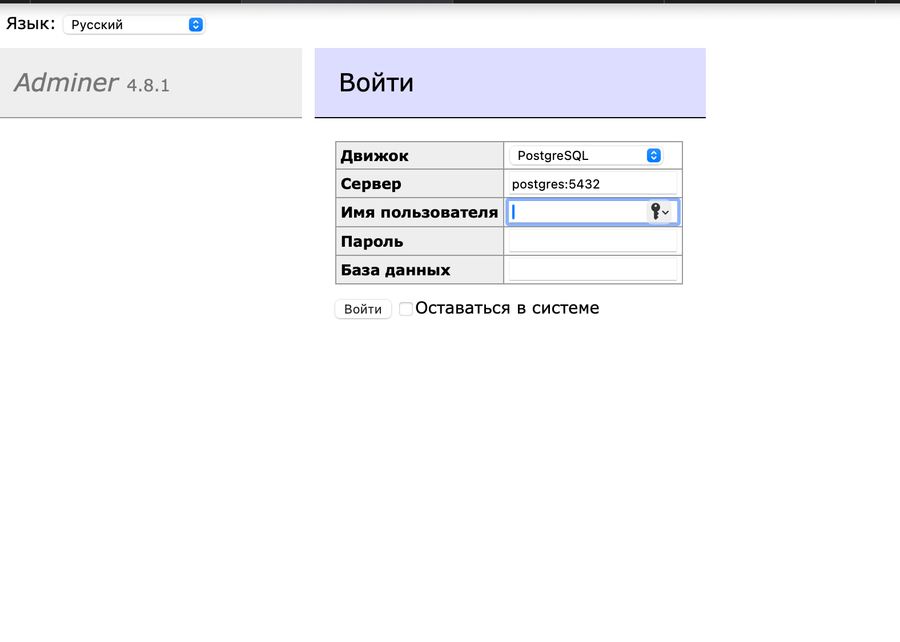

### Как подключиться к ui Adminer

* Переходим по ссылке http://localhost:8010
* Должны увидеть страницу входа
  

* Для входа вводим слудующие данные:
    - Движок - выбираем **PostgreSQL**
    - Сервер - указываем адрес инстанса БД. Так как подключаемся к контейнеру, расположенному в той сети, что и сам
      adminer, то можно указать имя сервиса с базой - **postgres:5432**
    - Имя пользователя - **postgres** (env в настройках сервиса)
    - Пароль - **postgres** (env в настройках сервиса)
    - База данных - **bookository** (env в настройках сервиса)